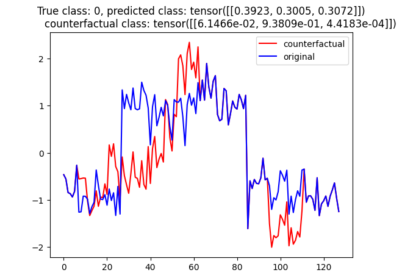

# MASCOTS

**_MASCOTS: Model-Agnostic Symbolic COunterfactual explanations for Time Series_**

ECMLPKDD 2025 (preceedings - WIP) / [arXiv:2503.22389](https://arxiv.org/abs/2503.22389) (preprint)

> Counterfactual explanations provide an intuitive way to understand model decisions by identifying minimal changes required to alter an outcome. However, applying counterfactual methods to time series models remains challenging due to temporal dependencies, high dimensionality, and the lack of an intuitive human-interpretable representation. We introduce MASCOTS, a method that leverages the Bag-of-Receptive-Fields representation alongside symbolic transformations inspired by Symbolic Aggregate Approximation. By operating in a symbolic feature space, it enhances interpretability while preserving fidelity to the original data and model. Unlike existing approaches that either depend on model structure or autoencoder-based sampling, MASCOTS directly generates meaningful and diverse counterfactual observations in a model-agnostic manner, operating on both univariate and multivariate data. We evaluate MASCOTS on univariate and multivariate benchmark datasets, demonstrating comparable validity, proximity, and plausibility to state-of-the-art methods, while significantly improving interpretability and sparsity. Its symbolic nature allows for explanations that can be expressed visually, in natural language, or through semantic representations, making counterfactual reasoning more accessible and actionable.

Please cite as:

```bibtex
@article{pludowski2025mascots,
  title={MASCOTS: Model-Agnostic Symbolic COunterfactual explanations for Time Series},
  author={P{\l}udowski, Dawid and Spinnato, Francesco and Wilczy{\'n}ski, Piotr and Kotowski, Krzysztof and Ntagiou, Evridiki Vasileia and Guidotti, Riccardo and Biecek, Przemys{\l}aw},
  journal={arXiv preprint arXiv:2503.22389},
  year={2025}
}
```

## Results

All experiments scrips are stored in `experiments/bin`. Please run them in the following order:

1. `train_classifier.sh`
2. `train_ae.sh`
3. `create_mcels_cf.sh` - if you want to recreate M-CELS [1]
4. `create_glacier_cf.sh` - if you want to recreate Glacier [2]
5. `create_borf_cf.sh`, `create_borf_cf_no_C.sh`
6. `create_borf_cf_gauss.sh` - for experimental gaussian process-based method for swapping symbols

## Requirements

For installing all dependencies, run `bash ./scripts/setup_env.sh`. Note it clone addiitonal [repository](https://github.com/DawidPludowski/borf) which is the adjusted version of BoRF [3].

For recreating experiments with Glacier [2], create conda environment with:

```bash
conda env create -f environment/environment_glacier.yml
```

## Code

* `bin` - python scripts for exploring methods (not used for the article)
* `config` - some sample configs for BoRF [3]; in `experiments` configs are mostly auto-generated
* `experiments` - python and bash scripts used for the article
* `mascots` - implementation of the **MASCOTS** method
* `scripts` - setuping bash scripts

## Examples

_See `notebooks_borf_lstm.ipynb` for the full example._

```python

from mascots.explainer.borf import BorfExplainer

X_train, y_train, X_test, y_test = load_dataset("CBF")()

blackbox = LSTM()
blackbox.fit(X_train, y_train)

explainer = BorfExplainer(lstm.forward_cls)
scores = explainer.build(X_train, RandomForestClassifier())

counterfactual, metadata = explainer.counterfactual(X_train)
counterfactual[0]
```



## References

[1] _Li, Peiyu, et al. "M-CELS: Counterfactual Explanation for Multivariate Time Series Data Guided by Learned Saliency Maps." arXiv preprint arXiv:2411.02649 (2024)._

[2] _Wang, Zhendong, et al. "Glacier: guided locally constrained counterfactual explanations for time series classification." Machine Learning 113.7 (2024): 4639-4669._

[3] _Spinnato, Francesco, et al. "Fast, Interpretable and Deterministic Time Series Classification with a Bag-Of-Receptive-Fields." IEEE Access (2024)._
